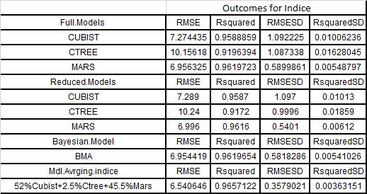
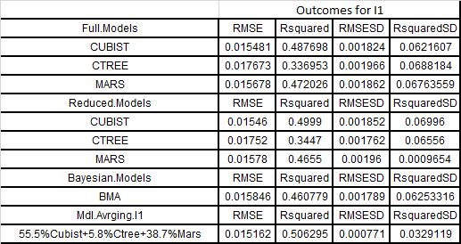
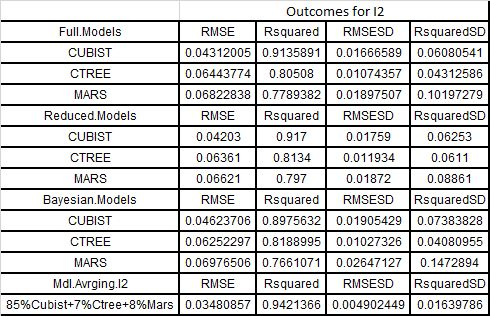
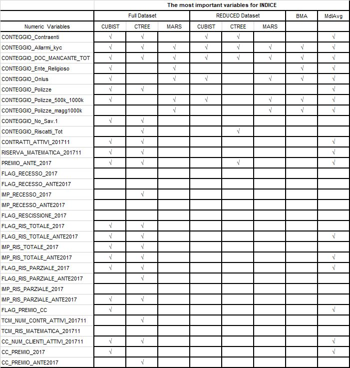
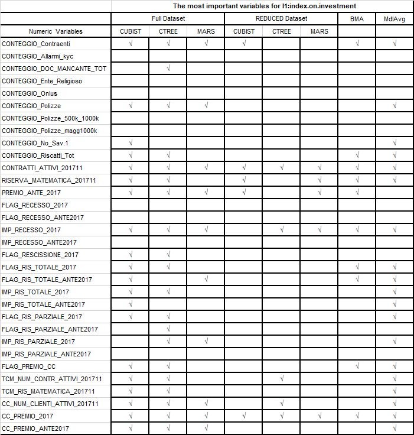
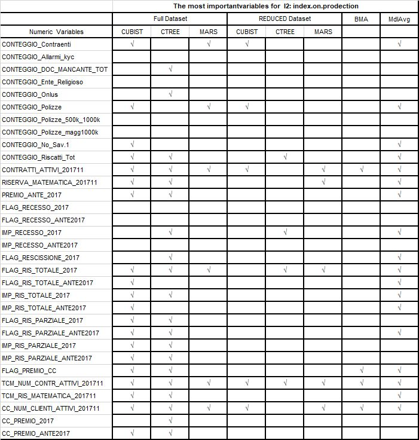

### Indroduction

Some models such as Tree & rule-based models, MARS and the lasso, are naturally resistant to non-informative predictors so these kind of models intrinsically conduct feature selection.

Feature selection process is to remove non-informative predictors from the model. Linear regression, partial least square, neural network and super vector machines are effected negatively by the reductant predictors, and they perform poorly. On the other hand, lasso, Mars and random forest resist and more or less perform the same even they are many non- informative predictors are exist.

Where,  `I1(index.on.investment) and I2(index.on.prodection)`

### Data Analysis

- To make sure we are doing apple to apple comparison, our model setting was the same for each step.
- Using Stratfied sampling method .
- Our model settings 80% train and 20% test set, using 10CV with 5 times repeat, 50 hold on.

In this study we model `INDICE, I1 and I2` with 3 models based on 3 different methodologies. Firstly, we applied the predictive models in to Full dataset and let the model choose the variables based on their importance for that specific model. Secondly, we reduced the dataset using Recursive Feature Elimination Incorporating Resampling Method (non a univariate method) then we model the reduced dataset.
We use Bayesian Adaptive Sampling for Bayesian Model Averaging and Variable Selection for INDICE, I1 and I2 using BIC parameter .Giving a uniform weights for each covariates, we evaluated  2^p models to find the important variables to explain dependent variables. 

**note:** we removed few outliers when they have the leverage and influencial effects.

### Outcomes

 Model Averaging has the best predictive power for Indice 
 Model Averaging has the best predictive power for I1
 Model Averaging has the best predictive power for I2

     

### Variable Importance For All Dependend Variables

