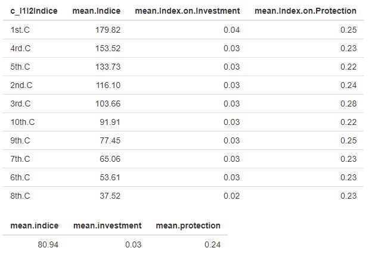

### Indroduction

We clustered Indice, I1 and I2 and compared the cluster's means with the overall means. Finally, we assigned as dangerous branches when the mean of the cluster is exciding the overall mean of Indice, I1 and I2.

Where, `I1(index.on.investment) and I2(index.on.prodection)`

### Data Analysis

In this part we did not exclude the outliers. Since our concern is to find the most dangerous clusters. We used K-nearest Neighbors Algorithm with euclidean distance measure.

### Outcomes

Comparing the average mean and the cluster means, 1st, 4rd and 5th clusters seems to be the most dangerous clusters.

**note:** go to APP4 -> Summary Tab